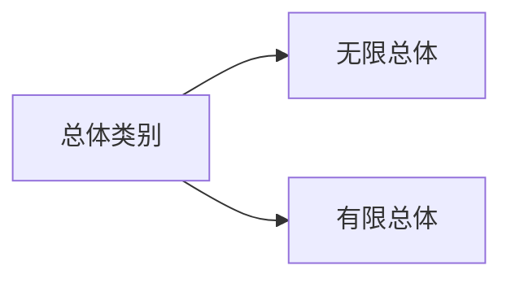
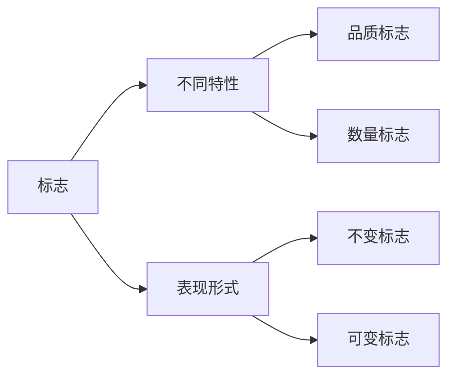

[TOC]
# Introduction

统计学的核心工作大致可以分为**描述统计**和**推断统计**。统计是一个压缩的过程，我们希望将海量的数据变成几个拥有特殊含义的数字，这就是**描述**，学习描述统计的重点在于，**对统计工作有一定的了解，对统计结果能做出分析，对于统计的概念能够有深刻的理解。** 而推断的出现，则是由于我们希望研究的对象数量上太过于庞大，只能进行抽样研究，所以推断研究的重点就在于如何将样本上得出的结论推广到总体上，现代统计学的核心在于**估计和检验**，对于样本而言估计和检验是没有难度的，但是对于总体数据而言随机现象的必然出现使得我们在样本上所得出的结论并不怎么严谨，必须通过一系列的统计检验才可以进行推广，所以推断统计又是一个**解压和安装**的过程，这是一个抽象的过程，势必需要数学的应用。

- 统计描述：加工、分组、列表图示、计算平均数、方差等指标
- 推断统计：
    - 估计：根据样本计算某一指标或者对总体参数进行估计
    - 检验：假设检验
## The History of statistics
- 英国的政治算术学派：威廉·配第：有实无名的统计学
- 德国的国势学派：康令和阿亨瓦尔：有名无实的统计学
- 数理统计学派：凯特勒：统计学之父《社会物理学》

## Outline of the statistics
统计工作（一种社调查研究活动）、统计资料（统计工作的成果、也即统计信息）、统计学（方法论调）
## Statistics Study Method
- 大量观测法：粗暴
- 综合指标法：总体的指标
- 归纳推断法：外延，界定标准：置信度和置信区间
- 统计模型法：多元统计、时间序列、方差分析
- 统计分组法：总体异质性的研究
- 大数定律：随机现象的基本规律

## Main Concept of statistics
### 统计总体与总体单位
统计总体是研究的对象
大量、同质、变异

大量同质个体的变异现象是统计学研究方法为其他学科做出的贡献。

🌰：要研究某市工业企业生产设备的使用情况，那么该市所有工业企业的全部生产设备为总体，每一台设备为总体单位。

### 统计标志与统计指标
⭐：**标志** 说明了 总体中**每个单位** 所具有的属性和特征

🌰：人口普查的总体单位是个人。性别、名字、宗教信仰、政治倾向就是品质标志，年龄、升高、体重就是数量标志。

⭐：**指标** 反应**总体**数量特征 

统计指标 = 时间 + 空间 + 指标名称 +具体数值 + 计量单位

- 数量性：没有没有数量的指标。
- 具体性：限制
- 综合性：个体的综合

#### 🎗️ 联系与区别

- 区别
    - 标志是说明总体单位特征的，指标则是说明统计总体数量特征的。
    - 有的标志用数值表示，有的标志用文字表示，而指标都是用数值表示的。
- 联系
    - 标志是总体指标的来源和基础，指标则是标志的综合。
    - 数量标志与指标之间存在着变换关系。

### 变异与变量

⭐：**变异** 指标和标志的具体表现存在的差别，狭义上指品质标志在不同的个体上具有不同的表现。如：姓名、性别、籍贯、爱好、政治面貌等

💡：变异是统计的前提，如果没有变异，统计就失去存在的必要

⭐：**变量** 可变的数量标志和统计指标，狭义上指数量标志在不同的个体上具有不同的表现。如：年龄，成绩，身高，体重等

- 定性变量
  - 定类变量：说明事物的类别，**数字之间**没有大小、优劣、高低等顺序之分
  - 定序变量：不仅说明事物内涵与性质，还表示有大小、高低、好坏**等序**之分。
- 定量变量，用数值表示事物特征
    - 定距变量：用数值表示事物的内涵与特征。不仅有类与序的含义，还可以进行**加减**，说明差距。

### 统计指标体系
### 时期指标与时点指标
