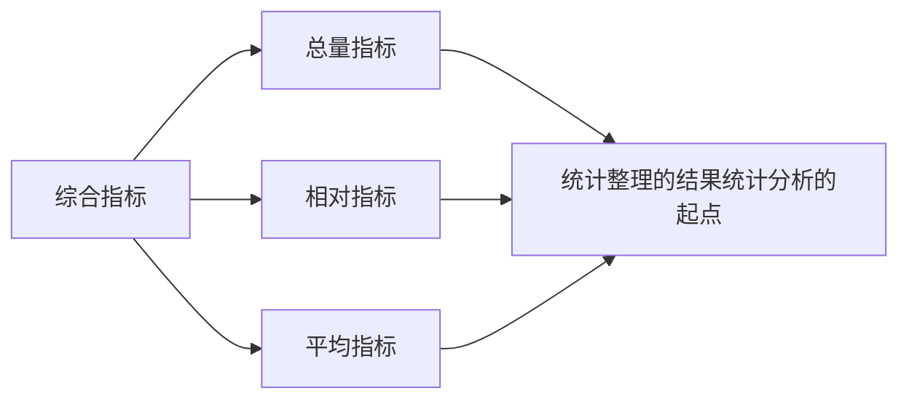
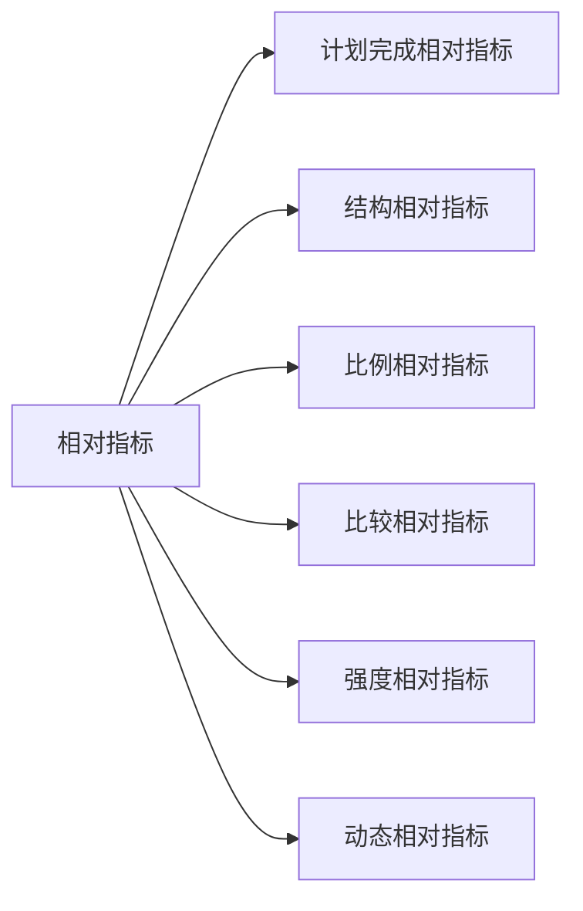

# 综合指标

采用统计指标概括和分析统计总体数量特征和数量关系的方法，了解相关指标的应用和指标体系的应用。

## 总量指标
反映社会经济现象**一定时间、地点、条件下**的总规模、总水平的统计指标。
表现为**绝对数、有名数**。

国民经济宏观管理和企业经济核算的基础性指标，是计算相对指标和平均指标的基础。

1. 同类总体
2. 统计口径一致
3. 计量单位一致

## 相对指标 

两个有联系的指标对比的比值，反映事物的数量特征和数量关系。
> 它可以是绝对数之比，也可以是相对数或平均数之比。

### 计划完成相对指标
基本公式如下
\( 计划完成相对数 = \frac{实际完成数}{计划数} \times 100% \)
1. 实际数和计划数本身为总量指标、相对指标或平均指标 ，则与基本公式相同
2.  当实际数和计划数**用提高或降低的百分数**表示时：
    - 越高越好：
\( 计划完成相对数 = \frac{1 + 实际完成数}{1 + 计划完成数} \times 100% \)
    - 越低越好：
\( 计划完成相对数 = \frac{1 - 实际完成数}{1 - 计划完成数} \times 100% \)

> 🌰：某企业计划本年度销售利润额比上年增长20%，实际增长50%；产品单位成本比上年降低10%，实际降低7%，则：
>
>\[ 销售利润计划完成程度 = \frac{1 + 50\%}{1 + 20\% } \times 100\% = 125\% \]
> \[ 单位成本计划完成程度 = \frac{1 - 7\%}{1 - 10\% } \times 100\% = 103.33\% \]
> 表明该企业销售利润额比计划多完成25%（越高越好），而单位成本差3.33%未完成计划
3. 计划执行进度（计划期未结束）
\(  计划执行进度 = \frac{累计完成数}{全全期完成数} \times 100\%\)

4. 长期计划的检查（计划期已结束）
    - 水平法
\(  计划执行进度 = \frac{长期计划某年达到的水平}{计划规定末年达到的水平} \times 100\%\)
    - 累计法
\(  计划执行进度 = \frac{长期计划期间累计完成数}{计划规定的累计数} \times 100\%\)

### 结构相对指标
\[ 结构相对数 = \frac{总体部分数值}{总体全部数值} \times 100% \]
### 比例相对指标
\[ 比例相对数 = \frac{总体中某一部分数值}{总体中 另一部分数值} \times 100% \]
### 比较相对指标
\[ 比较相对数 = \frac{某总体莫指标值}{另一总体同类指标值} \times 100% \]
### 强度相对指标
\[ 比较相对数 = \frac{某总体莫指标值}{另一总体同类指标值} \times 100% \]
### 动态相对指标
\[ 动态相对数 = \frac{报告期水平}{基期水平} \times 100% \]
